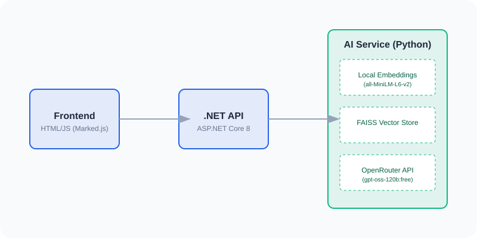

# AI Document Q&A Hub 🚀

A full-stack, Retrieval-Augmented Generation (RAG) system that allows you to upload large documents (PDF, DOCX, TXT) and ask questions about their content. This project is optimized for performance and is **100% free to operate** by combining local AI models with free cloud LLMs.



## ✨ Key Features

-   **Zero Cost**: Uses local embeddings (`all-MiniLM-L6-v2`) and OpenRouter's free models (`gpt-oss-120b:free`).
-   **Large Document Support**: Successfully tested with 300+ page PDFs.
-   **Smart Context**: Automatically finds the most relevant parts of your document to answer questions.
-   **Modern Dashboard**: Clean, responsive UI with real-time markdown rendering.
-   **Cross-Platform Stack**: Combines the power of .NET 8, Python (FastAPI), and Vanilla JS.

## 🏗️ Architecture

The system consists of three main components:

1.  **Frontend (Port 3000)**: A modern HTML5/JavaScript dashboard using `Marked.js` for markdown rendering.
2.  **Gateway API (Port 5000)**: An ASP.NET Core 8 Web API that manages communication and security.
3.  **AI Engine (Port 8000)**: A Python FastAPI service that handles:
    *   **Document Loading**: Parsing PDF, Word, and Text files.
    *   **Local Embedding**: Turning text into searchable vectors locally (Privacy-first & Free).
    *   **Vector Search**: Using FAISS to find context instantly.
    *   **LLM Orchestration**: Communicating with OpenRouter for high-quality answers.

## 🛠️ Setup Instructions

### 1. Prerequisites
-   [.NET 8.0 SDK](https://dotnet.microsoft.com/download/dotnet/8.0)
-   [Python 3.12+](https://www.python.org/downloads/)
-   An [OpenRouter API Key](https://openrouter.ai/keys) (Free)

### 2. Configure Environment
Create a `.env` file in the `ai-service` directory:
```env
OPENROUTER_API_KEY=your_free_key_here
```

### 3. Quick Start (Windows)
Simply double-click the `launch.bat` file in the root directory. This will start all three services in separate windows.

**OR Start Manually:**

-   **Python AI Service**:
    ```bash
    cd ai-service
    pip install -r requirements.txt
    uvicorn main:app --reload --port 8000
    ```
-   **.NET API**:
    ```bash
    cd dotnet-api
    dotnet run
    ```
-   **Frontend**:
    ```bash
    cd frontend
    python -m http.server 3000
    ```

## 🚀 Usage

1.  Open your browser to `http://localhost:3000`.
2.  Select a document (e.g., a technical manual or a 300-page book).
3.  Click **Upload Document** and wait for the "Ready" status.
4.  Type your question in the chat box and press **Enter**.
5.  View the AI's response, complete with formatted lists and headers!

## 🔧 Technologies Used

-   **Backend**: Python, FastAPI, LangChain, FAISS, HuggingFace Transformers.
-   **API Gateway**: C#, ASP.NET Core 8, HttpClient.
-   **Frontend**: HTML5, CSS3, Modern JavaScript, Marked.js.
-   **Models**: `all-MiniLM-L6-v2` (Local), `gpt-oss-120b:free` (OpenRouter).

---
*Created for efficient, privacy-conscious document intelligence.*
